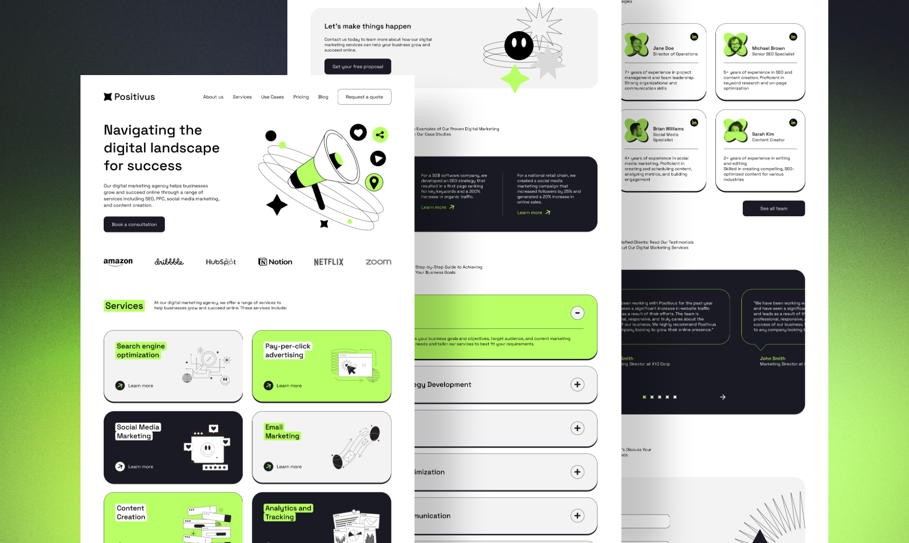

# 🚀 SparkAstro - 多内容类型博客系统

基于 Astro.js v5.0.9 构建的现代化数字营销网站，具备强大的多内容类型博客管理功能。

> **🚨 重要提示：本项目使用 .astro 文件作为博客内容是核心设计特性，请勿将其转换为 .md 文件！**
> 
> **📜 请在修改代码前仔细阅读下方“关于 .astro 博客文件的设计理念”章节。**

[](https://astro.build/)
[](https://tailwindcss.com/)
[](https://www.typescriptlang.org/)
[](LICENSE.md)



## ✨ 核心特性

### 🎯 多内容类型博客系统
- **🟢 Markdown 文章**：支持标准 Markdown 语法，适合快速创作
- **🟣 Astro 组件文章**：交互式富媒体内容，支持自定义组件
- **🔴 YouTube 视频**：集成视频内容，一站式媒体管理

### 🖼️ 智能图片管理
- **统一存储**：图片集中存储在 `src/content/blog/images/`
- **自动优化**：支持多种格式，自动压缩和优化
- **响应式显示**：自适应不同设备尺寸

### 🛣️ 高级路由系统
- **动态路由**：支持多层路径结构
- **SEO 友好**：自动生成 sitemap 和元数据
- **内容集合**：使用 Astro v5 内容集合系统

### 🎨 现代化设计
- **响应式布局**：完美适配桌面、平板、手机
- **深色/浅色模式**：用户偏好自适应
- **流畅动画**：基于 Lenis 的平滑滚动体验

## 🏗️ 项目架构

### 📁 目录结构
```
SparkAstro/
├── src/
│   ├── content/blog/          # 博客内容管理
│   │   ├── MDFile/            # 📝 Markdown 文章
│   │   ├── AstroFile/         # 🎨 Astro 组件文章
│   │   ├── images/            # 🖼️ 图片资源
│   │   ├── videoData.json     # 📹 视频数据
│   │   └── config.ts          # ⚙️ 内容配置
│   ├── pages/                 # 页面路由
│   │   ├── blog/              # 博客路由
│   │   │   ├── [...slug].astro # 动态路由处理
│   │   │   └── index.astro    # 博客首页
│   │   └── api/               # API 接口
│   ├── components/            # UI 组件库
│   ├── layouts/               # 页面布局
│   ├── utils/                 # 工具函数
│   └── styles/                # 样式文件
├── scripts/                   # 自动化脚本
├── public/                    # 静态资源
└── docs/                      # 项目文档
```

### 🔧 技术栈

| 技术 | 版本 | 用途 |
|------|------|------|
| **Astro.js** | v5.0.9 | 静态站点生成器 |
| **Tailwind CSS** | v3.4.3 | 原子化 CSS 框架 |
| **TypeScript** | v5.4.5 | 类型安全的 JavaScript |
| **Lenis** | v1.0.45 | 平滑滚动库 |
| **Swiper** | v11.1.3 | 现代滑动组件 |

## 🚀 快速开始

### 📋 环境要求
- **Node.js**: v16+ (推荐 v18+)
- **包管理器**: npm 或 pnpm
- **操作系统**: Windows / macOS / Linux

### ⚡ 安装步骤

1. **克隆项目**
   ```bash
   git clone <repository-url>
   cd SparkAstro
   ```

2. **安装依赖**
   ```bash
   npm install
   ```

3. **启动开发服务器**
   ```bash
   npm run dev
   ```

4. **打开浏览器**
   访问 `http://localhost:4321`

### 📝 创建内容

#### 🟢 创建 Markdown 文章
```bash
# 使用自动化脚本
npm run create-blog

# 或手动创建
# 在 src/content/blog/MDFile/ 目录下创建 .md 文件
```

#### 🟣 创建 Astro 文章
```astro
---
title: "文章标题"
pubDate: "2025-01-20"
author: "作者名"
tags: ["标签1", "标签2"]
summary: "文章摘要"
type: "技术文章"
featured: true
---

<!-- 文章内容 -->
<h1>🎉 Astro 文章示例</h1>
```

#### 🔴 添加 YouTube 视频
在 `src/content/blog/videoData.json` 中添加视频信息：
```json
{
  "featuredVideos": [
    {
      "title": "视频标题",
      "videoId": "YouTube_VIDEO_ID",
      "description": "视频描述",
      "publishDate": "2025-01-20"
    }
  ]
}
```

## 🎯 主要功能

### 📊 博客管理系统
- **内容类型管理**：支持 Markdown、Astro、视频三种类型
- **标签系统**：自动生成标签云和分类
- **搜索功能**：全文搜索支持
- **分页系统**：自动分页处理

### 🔴 重要：关于 .astro 博客文件的设计理念

> **⚠️ 请注意：本项目特意使用 .astro 文件作为博客内容格式，这是核心设计特性，不是错误！**

#### 为什么使用 .astro 文件写博客？

1. **🎨 交互式内容**
   - 支持自定义组件和交互元素
   - 可以嵌入动画、图表、表单等富媒体内容
   - 提供比 Markdown 更强大的表现力

2. **🧩 组件化架构**
   - 可以重用现有的 UI 组件库
   - 保持设计系统的一致性
   - 支持复杂的布局和样式

3. **⚡ 性能优化**
   - Astro 岛屿架构实现按需加载
   - 静态生成时优化 JavaScript 输出
   - 更好的 SEO 和加载性能

4. **🔧 开发体验**
   - TypeScript 支持和类型检查
   - IDE 智能提示和语法高亮
   - 统一的开发工具链

#### ❌ 请不要将 .astro 文件转换为 .md 文件

- `.astro` 文件是本项目的**核心特性**，不是需要修复的问题
- 转换为 `.md` 会丢失交互功能和组件支持
- 这会破坏项目的设计架构和用户体验
- 如果需要简单的文本内容，请使用 `MDFile/` 目录下的 Markdown 文件

#### 🎯 正确的使用方式

```
✅ 正确：保持 .astro 文件用于富媒体博客内容
✅ 正确：使用 MDFile/ 目录下的 .md 文件用于简单文本
✅ 正确：根据内容复杂度选择合适的格式

❌ 错误：将 .astro 文件转换为 .md 文件
❌ 错误：删除 AstroFile/ 目录
❌ 错误：认为使用 .astro 写博客是问题
```

### 🗂️ 内容类型选择指南

| 内容类型 | 使用场景 | 文件格式 | 存储位置 |
|---------|---------|---------|----------|
| **简单文章** | 纯文本、基础格式 | `.md` | `src/content/blog/MDFile/` |
| **富媒体文章** | 交互组件、复杂布局 | `.astro` | `src/content/blog/AstroFile/` |
| **视频内容** | YouTube 视频展示 | `JSON` | `src/content/blog/videoData.json` |

### 🖼️ 图片管理
- **统一存储**：`src/content/blog/images/` 目录管理
- **路径引用**：相对路径 `../images/filename.png`
- **格式支持**：PNG、JPG、WebP、SVG
- **自动优化**：构建时自动压缩

### 🛣️ 路由系统
- **动态路由**：`[...slug].astro` 支持多层路径
- **静态生成**：构建时预渲染所有页面
- **SEO 优化**：自动生成 meta 标签和结构化数据

### 🎨 UI/UX 特性
- **响应式设计**：移动优先的设计理念
- **暗色模式**：系统偏好自动切换
- **平滑动画**：基于 CSS 和 JavaScript 的流畅体验
- **可访问性**：遵循 WCAG 2.1 标准

## 🧞 命令行工具

| 命令 | 功能 |
|------|------|
| `npm install` | 安装项目依赖 |
| `npm run dev` | 启动开发服务器 (localhost:4321) |
| `npm run build` | 构建生产版本到 `./dist/` |
| `npm run preview` | 预览构建结果 |
| `npm run create-blog` | 交互式创建博客文章 |
| `npm run astro check` | 检查 TypeScript 类型 |
| `npm run astro sync` | 同步内容集合类型 |

## 📚 开发指南

### 🎨 自定义组件
```astro
---
// src/components/custom/MyComponent.astro
interface Props {
  title: string;
  description?: string;
}

const { title, description } = Astro.props;
---

<div class="custom-component">
  <h2>{title}</h2>
  {description && <p>{description}</p>}
</div>

<style>
  .custom-component {
    @apply p-6 bg-white rounded-lg shadow-md;
  }
</style>
```

### 🛣️ 添加新路由
在 `src/pages/` 目录下创建 `.astro` 文件：
```astro
---
// src/pages/custom-page.astro
import Layout from '../layouts/MainLayout.astro';
---

<Layout title="自定义页面">
  <main>
    <h1>自定义页面内容</h1>
  </main>
</Layout>
```

### 📝 内容集合配置
在 `src/content/config.ts` 中定义 schema：
```typescript
import { defineCollection, z } from 'astro:content';

const blogCollection = defineCollection({
  type: 'content',
  schema: z.object({
    title: z.string(),
    pubDate: z.date(),
    author: z.string(),
    tags: z.array(z.string()),
    summary: z.string(),
    type: z.string(),
    featured: z.boolean().default(false)
  })
});

export const collections = {
  blog: blogCollection
};
```

## 🔧 部署

### 📦 构建生产版本
```bash
npm run build
```

### 🌐 部署选项
- **Netlify**: 推荐，支持自动部署
- **Vercel**: 零配置部署
- **GitHub Pages**: 免费静态托管
- **自定义服务器**: 上传 `dist/` 目录

### 🔒 环境变量
创建 `.env` 文件：
```env
# 站点配置
SITE_URL=https://your-domain.com
SITE_TITLE=SparkAstro
SITE_DESCRIPTION=多内容类型博客系统

# 第三方服务
GOOGLE_ANALYTICS_ID=G-XXXXXXXXXX
```

## 📈 性能优化

### ⚡ 内置优化
- **静态生成**：所有页面预渲染
- **代码分割**：按需加载 JavaScript
- **图片优化**：自动压缩和格式转换
- **CSS 压缩**：生产环境自动压缩

### 📊 性能指标
- **Lighthouse 分数**: 95+
- **首次内容绘制**: < 1.5s
- **最大内容绘制**: < 2.5s
- **累积布局偏移**: < 0.1

## 🤝 贡献指南

### 📜 贡献原则

**⚠️ 特别注意：**
- **禁止将 .astro 文件转换为 .md 文件**
- **禁止删除或移动 AstroFile/ 目录**
- **禁止修改项目的核心架构设计**
- **在提交 PR 前请先阅读“关于 .astro 博客文件的设计理念”章节**

### 🔄 贡献流程

1. **Fork 项目**
2. **创建功能分支**: `git checkout -b feature/amazing-feature`
3. **提交更改**: `git commit -m 'Add amazing feature'`
4. **推送分支**: `git push origin feature/amazing-feature`
5. **创建 Pull Request**

## 📞 支持与社区

- **文档**: [项目文档](./docs/)
- **问题反馈**: [GitHub Issues](https://github.com/your-repo/issues)
- **讨论**: [GitHub Discussions](https://github.com/your-repo/discussions)
- **更新日志**: [CHANGELOG.md](./CHANGELOG.md)

## 📄 许可证

本项目采用 MIT 许可证 - 查看 [LICENSE.md](LICENSE.md) 了解详情。

## 🙏 致谢

感谢以下开源项目：
- [Astro.js](https://astro.build/) - 现代静态站点生成器
- [Tailwind CSS](https://tailwindcss.com/) - 原子化 CSS 框架
- [TypeScript](https://www.typescriptlang.org/) - JavaScript 的超集
- [Lenis](https://github.com/studio-freight/lenis) - 平滑滚动库

---

<div align="center">
  <strong>🚀 SparkAstro - 让内容创作更简单，让网站更出色！</strong>
</div>
